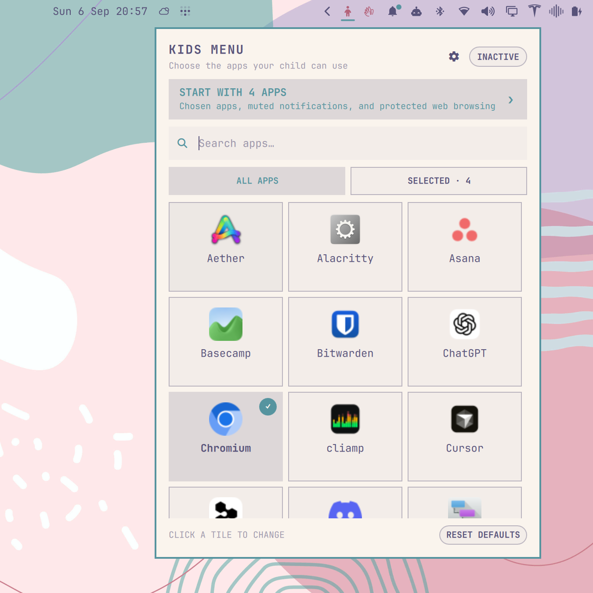

# Omarchy Kids Menu



Omarchy Kids Menu adds **Kids Mode** to your desktop. When it is on, a child
sees only the apps you choose. Your windows are hidden, shortcuts to other apps
and settings are paused, and Chromium and supported web apps use a separate
browser profile.

## Install

Requires Omarchy 4 with the Quattro shell, Chromium, and the standard `hyprctl`, `jq`, `flock`, Coreutils, and `uwsm-app` tools. The plugin does not install packages or download code, and it does not need `sudo` or `pkexec`.

```bash
omarchy plugin add https://github.com/elgevan/omarchy-kids-menu.git --enable
```

## Use

1. Click the Kids Mode button on the right side of the bar.
2. Choose the apps the child can use.
3. Click **Start Kids Mode**.

The Omarchy button now opens the selected apps. To finish, open the Kids Mode
panel and click **Exit Kids Mode**. When you leave Kids Mode, Omarchy asks for your password or fingerprint and restores your desktop as it was.

The separate browser profile is kept between sessions at:

```text
~/.local/share/omarchy-kids/chromium
```

Other browsers and apps use their normal profiles. Kids Mode does not filter
websites and is not a replacement for a separate Linux user or parental
controls. It is intended for supervised use. The exit check prevents accidental
access, but software running as the same Linux user can still change the plugin's files or turn it off.

## Remove

Exit Kids Mode, then run:

```bash
omarchy plugin remove io.github.elgevan.omarchy-kids
```

Your app list and browser profile are kept in case you reinstall the plugin.

## Development

Validate the plugin and run its test suite before publishing changes:

```bash
omarchy plugin validate .
./test/run
```

`test/vm-acceptance` runs the full flow in a disposable Omarchy VM. After
replacing an installed local copy, run `omarchy restart shell`.

## License

[MIT](LICENSE)
